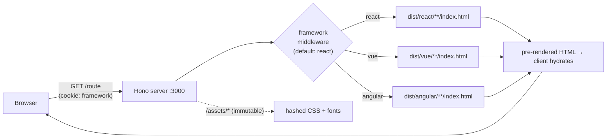
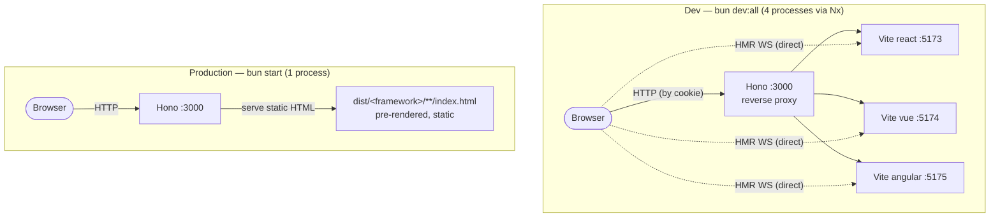

# fortunatogeelhoed.com

<!-- Live / earned -->
[](https://github.com/fortunato/fortunatogeelhoed.com/actions/workflows/ci.yml)
[](https://codecov.io/gh/fortunato/fortunatogeelhoed.com)
[](https://components.fortunatogeelhoed.com)
[](./LICENSE)

<!-- Stack -->


<!-- Quality -->


A portfolio site built three times — in React, Vue, and Angular — served from a single Bun/Hono backend. The same content, the same design, three different framework implementations.

## Architecture

In production, a single Hono server reads the `framework` cookie and serves the matching pre-rendered HTML. The client hydrates the framework it was sent.



### Dev vs. production

The same `:3000` entry point behaves very differently in the two modes. In dev, Hono is a **reverse proxy** in front of three live Vite servers; in production it serves static pre-rendered HTML. HMR WebSockets connect **directly** to each Vite server, bypassing the proxy (which forwards HTTP only).



For the request lifecycle, the dev topology, and the rationale behind the Vite/Nx dev configuration, see [`docs/architecture.md`](docs/architecture.md). For why this stack was chosen and what alternatives were rejected, see [`docs/decisions.md`](docs/decisions.md).

**Key decisions:**

- **SSG from day one.** All frameworks pre-render every route at build time. The server sends static HTML; the client hydrates.
- **Cookie-based switching.** A `framework` cookie (default: `react`) tells Hono which pre-rendered output to serve. A vanilla JS switcher in the HTML shell toggles it.
- **React is canonical.** Vue and Angular variants carry `<meta name="robots" content="noindex">` to avoid duplicate content.
- **CDN-ready assets.** CSS is content-hashed (`styles-[hash].css`), static assets served with `Cache-Control: immutable`, HTML served with `no-cache`.
- **Shared content pipeline.** Gray-matter parses Markdown frontmatter at build time; all frameworks consume the same content.
- **Single runtime.** Bun handles everything — dev server, builds, SSG scripts, production serving.

## Tech Stack

| Layer | Technology |
|-------|-----------|
| Runtime | Bun 1.3+ |
| Server | Hono |
| React | React 19, React Router 7, custom prerender script |
| Vue | Vue 3.5, Vue Router 4, vite-ssg |
| Angular | Angular 21, AnalogJS (Vite-powered) |
| Content | gray-matter + Markdown |
| Build | Vite 6, Nx (integrated monorepo) |
| Lint/Format | Biome (tabs, 4-space width, single quotes) |

## Getting Started

> **Prerequisites:** Bun 1.3+ and **Node.js ≥ 22** (the repo pins 24.16.0 via `.nvmrc`). Bun runs the servers and scripts, but the Angular build relies on `@angular/build`, which requires `require()` of ES modules — unsupported before Node 22. Building on Node 20 fails with `ERR_REQUIRE_ESM`.

```bash
# Install Bun (if needed)
curl -fsSL https://bun.sh/install | bash

# Use the pinned Node version
nvm use   # reads .nvmrc (24.16.0)

# Install dependencies
bun install

# Dev mode — single framework + Hono
bun dev:react    # React on :5173, Hono on :3000
bun dev:vue      # Vue on :5174, Hono on :3000
bun dev:angular  # Angular on :5175, Hono on :3000

# Dev mode — all frameworks at once
bun dev:all

# Production build
bun run build

# Production serve
bun start        # Hono on :3000, serves pre-rendered HTML
```

## Project Structure

```
repo/
├── packages/
│   ├── api/          # Hono server (framework middleware, shell, static serving)
│   ├── react/        # React app (React Router, custom SSG via renderToString)
│   ├── vue/          # Vue app (Vue Router, vite-ssg)
│   ├── angular/      # Angular app (standalone components, AnalogJS)
│   ├── shared/       # TypeScript types (ContentItem, RouteDefinition)
│   └── content/      # Gray-matter content parser, markdown pages and articles
├── styles/           # Shared CSS (reset, design tokens, base styles)
├── static/fonts/     # Self-hosted variable fonts (Rubik, Space Grotesk, JetBrains Mono)
├── scripts/          # Build utilities (CSS hashing)
├── nx.json           # Nx workspace config
├── biome.json        # Linter/formatter config
└── package.json      # Root monorepo package
```

## Framework Switcher

Visit the site and use the switcher buttons at the top. The switcher is vanilla JS injected by the Hono shell — it sets a cookie and reloads the page. Each framework renders the same routes with the same content from the same CSS.

## Component showcase

The design system is also published as an interactive component catalogue at
**[components.fortunatogeelhoed.com](https://components.fortunatogeelhoed.com)** — the same
components rendered in React, Vue, Angular, and as the shared native web components, federated
into one site. Cross-framework parity is enforced by an automated visual-regression check.

```bash
bun run storybook         # composition portal on :6006
bun run build-storybook   # assemble the static catalogue into dist/storybook
bun run test:visual       # cross-framework visual-regression parity gate
```

See [`docs/component-showcase.md`](docs/component-showcase.md) for usage and
[`docs/component-showcase-architecture.md`](docs/component-showcase-architecture.md) for the
design rationale.

## Content

Pages are Markdown files with frontmatter in `packages/content/src/pages/`:

```markdown
---
title: About
slug: about
type: page
description: Senior TypeScript engineer based in Spain.
---

Body content here (rendered as text in page components).
```

The content library exports `getPage(slug)` and `listByType(type)` — consumed at build time by each framework's SSG process.

Articles live in `packages/content/src/posts/` (one Markdown file per article, with a `tag` and a `date` in the frontmatter). At build time their bodies are rendered to HTML once, surfaced at `/writing` (the index) and `/writing/<slug>` (each article), and the newest ones feed the homepage. See [`docs/writing-area.md`](docs/writing-area.md) for how the pipeline fits together.

## License

The **source code** of this repository is released under the [MIT License](LICENSE) — read it, learn from it, and reuse it freely.

The **personal content** under `packages/content/` (bio, project descriptions, copy) and the "Fortunato Geelhoed" / "JiggyBit" names and brand assets are © 2026 Fortunato Geelhoed / JiggyBit S.L., all rights reserved. Please build your own portfolio rather than cloning this one wholesale.
