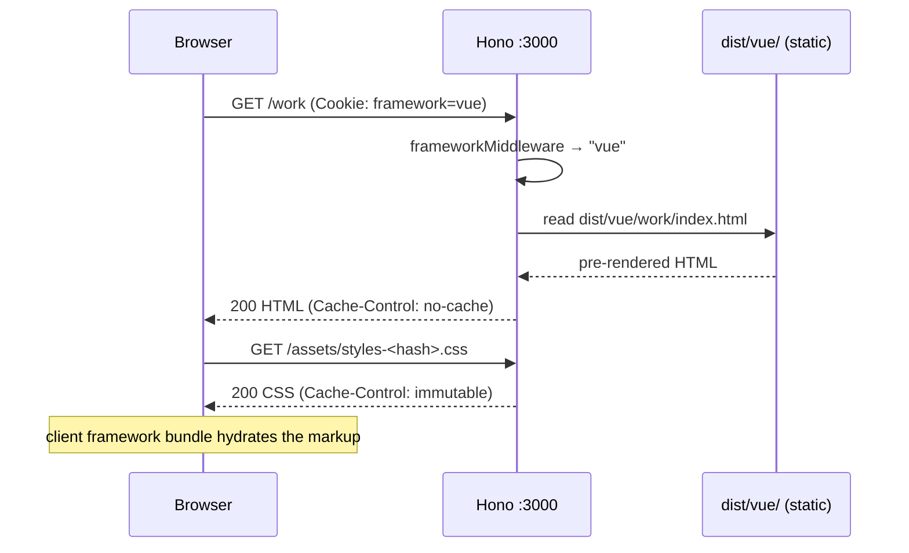
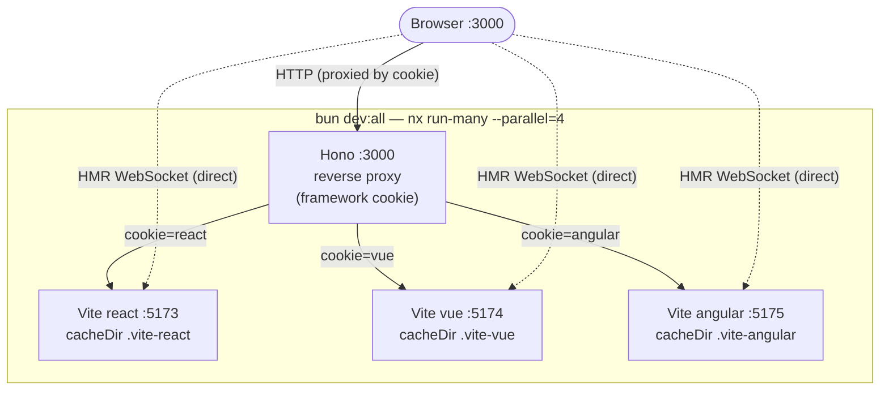

# Architecture

This document goes a level deeper than the [README](../README.md): the request
lifecycle, the development topology, and the reasoning behind the Vite/Nx dev
configuration. For why this stack was chosen over the alternatives, see
[`decisions.md`](decisions.md).

## One entry point, two modes

Everything is served from `http://localhost:3000` — a Hono server
(`packages/api/src/index.ts`). What sits behind that port depends on
`NODE_ENV`:

- **Production** (`bun start`) — Hono serves pre-rendered static HTML from
  `dist/<framework>/`.
- **Development** (`bun dev:all`) — Hono is a thin reverse proxy in front of
  three live Vite dev servers, one per framework.

The framework is selected by a `framework` cookie (`react` | `vue` |
`angular`), defaulting to `react`. The same cookie drives both modes — only the
thing it routes _to_ changes.

## Production request lifecycle



- HTML is served with `no-cache` so the latest deploy is always picked up.
- Hashed assets (`styles-<hash>.css`, fonts) are served `immutable` with a
  one-year max-age — safe because the hash changes when the content does.
- React is canonical for SEO; Vue and Angular responses carry
  `<meta name="robots" content="noindex">` to avoid duplicate-content penalties.

## Development topology

`bun dev:all` starts **four** long-running processes through Nx: the Hono
server plus one Vite dev server per framework.



Two distinct channels reach the browser:

1. **HTTP** flows through the proxy: the browser talks only to `:3000`; Hono
   forwards each request to the Vite server matching the cookie. If that Vite
   server is down, Hono serves a placeholder shell instead of failing.
2. **HMR WebSockets** connect **directly** to each Vite port. The proxy
   forwards HTTP only, so HMR must skip it (see below).

## Dev configuration rationale

Three settings in each `packages/<framework>/vite.config.ts` (and the root
`dev:all` script) exist specifically to make the multi-Vite-behind-a-proxy
setup work. They are easy to remove by accident, so they are documented here.

### 1. Isolated `cacheDir` per framework

All three packages share the hoisted `repo/node_modules`, so Vite's default
optimized-deps cache (`node_modules/.vite`) resolves to the **same** directory
for all of them. Running them concurrently makes them clobber each other's
optimized deps — whichever server (re)optimizes last wins, and the others start
returning `504 Outdated Optimize Dep` for their entry deps (e.g. React's
`react-dom_client`, Vue's `vite-ssg`).

Fix — give each its own cache:

```ts
cacheDir: resolve(__dirname, '../../node_modules/.vite-react') // / -vue / -angular
```

### 2. `--parallel=4` on `dev:all`

`nx run-many` defaults to **3** concurrent tasks, but `dev:all` launches **4**
long-running servers (react, vue, angular, api). Dev servers never "complete",
so the 4th target stays queued forever — typically leaving nothing listening on
`:3000`. Pinning the parallelism to 4 lets all of them run:

```json
"dev:all": "nx run-many -t dev -p react vue angular api --parallel=4"
```

### 3. `hmr.clientPort` per Vite server

When the app is loaded through the proxy at `:3000`, Vite's HMR client tries to
open its WebSocket against the page origin (`:3000`). The Hono proxy uses
`app.all('*')` with `fetch` — it forwards HTTP but **not** WebSocket upgrades —
so the socket fails. On failure Vite pings the HTTP server, gets a `200`,
assumes the server restarted, and calls `location.reload()`. The reload re-runs
the same failing handshake → **infinite reload loop**.

Fix — pin HMR to each Vite server's own port so the WebSocket connects directly,
bypassing the proxy:

```ts
server: {
    port: 5173,
    strictPort: true,
    hmr: { clientPort: 5173 }, // 5174 for vue, 5175 for angular
}
```

> Alternative considered: teach the Hono proxy to handle WebSocket upgrades so
> HMR also flows through `:3000`. That keeps dev single-origin but adds proxy
> complexity for no production benefit, so pinning `clientPort` was preferred.

## Build pipeline

`bun run build` runs in order:

1. `build:css` — concatenates `styles/` and writes a content-hashed
   `dist/assets/styles-<hash>.css` plus a `manifest.json` the server reads to
   resolve the hashed path.
2. `build:content` — parses Markdown frontmatter (gray-matter) into the content
   the frameworks consume.
3. `nx run-many -t build -p react vue angular api` — each framework
   pre-renders every route to `dist/<framework>/<route>/index.html`; the API is
   bundled for Bun.
