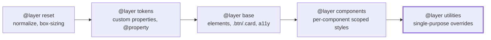
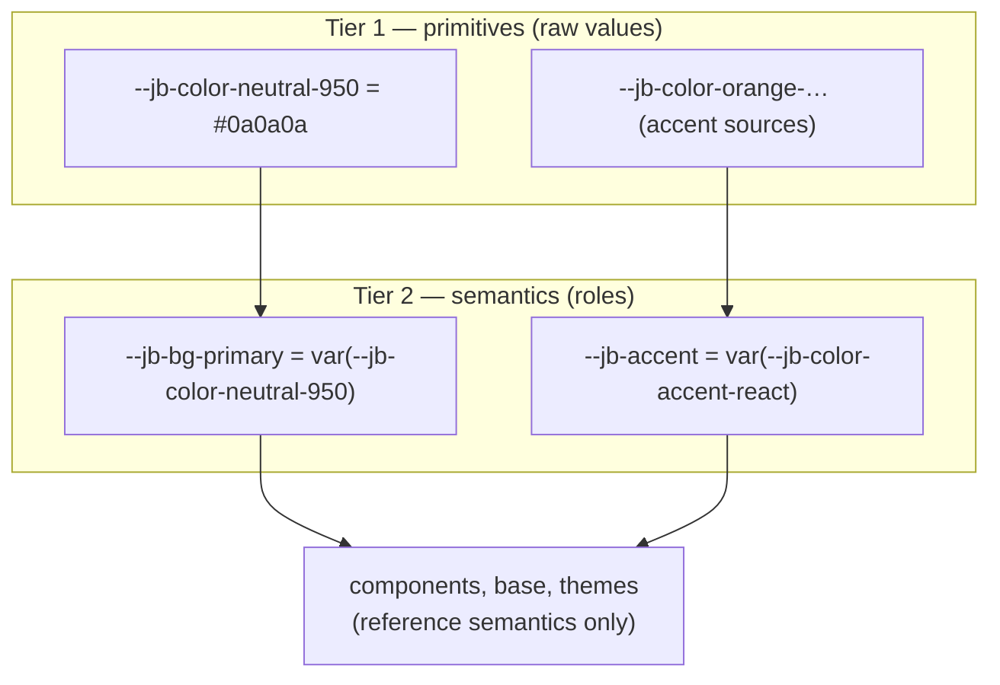
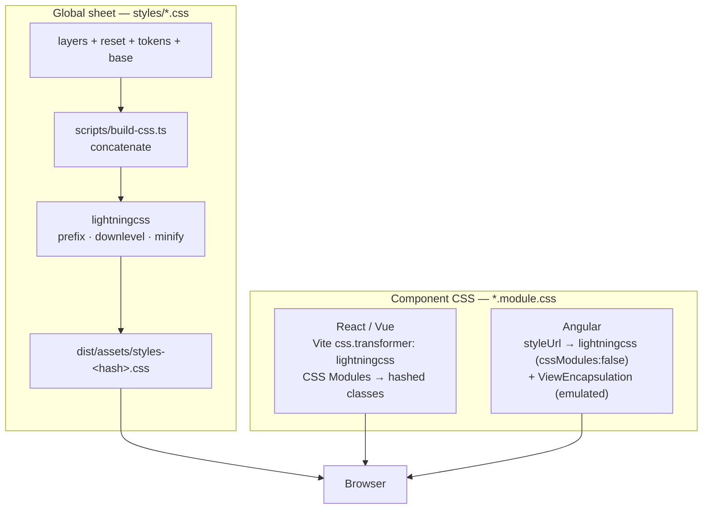
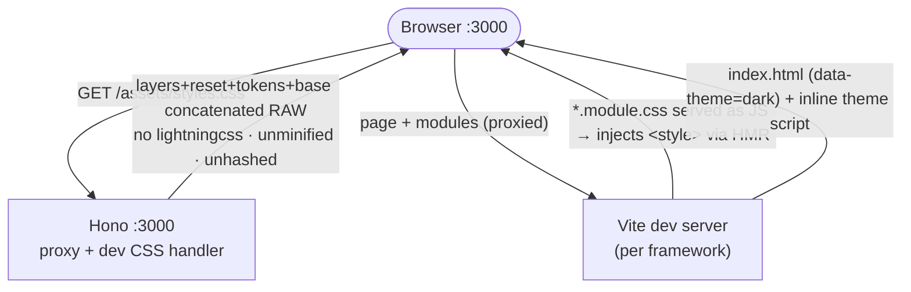

# CSS Architecture

How styling is structured across the three framework variants: an explicit
cascade, a namespaced two-tier token system, two distinct build pipelines, and a
zero-flash theme. The goal is that the same design system renders identically in
React, Vue, and Angular, with conflicts resolving deterministically regardless of
load order.

## Cascade layers

All styles live in named cascade layers, declared once in `styles/layers.css` and
loaded before any other rule. Later layers win; within a layer, normal specificity
and source order apply. This makes conflict resolution independent of which
stylesheet loads first.

- Precedence increases left → right; `utilities` wins, `reset` loses.
- **Unlayered styles beat all layered styles** — so the rule is that *everything*
  global lands in a layer. The one deliberate exception is per-component scoped
  CSS (see below): those selectors are already unique, so leaving them unlayered
  is harmless and they correctly win over generic `@layer base` rules.

## Design tokens — two tiers, one namespace

Tokens use the `--jb-` namespace (JiggyBit) so they can't collide with third-party
custom properties in the shared cascade (custom properties are *not* scoped by CSS
Modules or Angular emulation). They are organized in two tiers: **primitives** hold
raw values; **semantics** name a role and reference a primitive. Components and
themes consume **semantic** tokens only.

- Primitives can be re-tuned freely; only the semantic names are a stable contract.
- Themes (`[data-theme="dark|light"]`) remap the semantic surface/text tokens to
  different primitives. Per-framework accent is the only intended visual
  difference: `[data-framework]` reassigns `--jb-accent` to the matching primitive.

## Two CSS pipelines

The **global stylesheet** and the **per-component styles** are built by two
separate toolchains — a distinction that must be explicit, because it determines
where prefixing/downleveling happens and how class names are scoped.

- The global sheet is hand-concatenated by `build-css.ts`; **lightningcss is its
  only processing step** (prefixing, downleveling to the Baseline floor, and
  minification — see `scripts/css-targets.ts`). High value here.
- Component CSS is small and goes through each framework's own pipeline. React/Vue
  run it through Vite's lightningcss transformer (auto-prefixes e.g.
  `backdrop-filter`). Angular compiles `styleUrl` through its **own** compiler, so
  it does not use Vite's transformer at all.
- These two pipelines also behave differently between dev and production — see
  [Dev vs production](#dev-vs-production).

## Per-framework component scoping

| Variant | Scoping | Class access |
|---|---|---|
| React | CSS Modules (hashed) | `styles.header`, `styles['switcher-btn']` |
| Vue | CSS Modules (hashed) | `:class="styles['switcher-btn']"` |
| Angular | ViewEncapsulation (emulated, `_ngcontent`) | literal `class="switcher-btn"` |

Two decisions here are deliberate and non-obvious:

1. **Angular runs lightningcss with CSS Modules disabled**
   (`css.lightningcss.cssModules: false`). lightningcss prefixes/downlevels
   Angular's component CSS to the shared targets but does **not** hash class names,
   so Angular's emulated ViewEncapsulation stays responsible for scoping (it
   rewrites `.header` → `.header[_ngcontent-…]`). Note `css.modules` is *ignored*
   under lightningcss — `css.lightningcss.cssModules` is the effective switch; an
   initial attempt that left hashing on produced `.gMpzIq_header`, which never
   matched Angular's `class="header"` and broke styling.
2. **Kebab class names + bracket access, no `localsConvention`.** Class names are
   conventional kebab-case (`.switcher-btn`). The React/Vue Vite configs do **not**
   set `localsConvention: 'camelCase'` — under lightningcss that conversion silently
   drops multi-word locals from the JS export map. Multi-word classes are therefore
   read via bracket access (`styles['switcher-btn']`); single-word ones use dot
   access (`styles.header`).

> Component `@layer components` placement is intentionally deferred: hand-wrapping
> the shared module file breaks Angular's emulated encapsulation, so components are
> currently unlayered (correct — scoped styles legitimately win over `@layer base`).

## Theme resolution & zero-flash

Dark is the default. The initial theme resolves **stored choice → system
preference → dark**, and must be correct before first paint.

- The cookie is server-readable, so the Hono shell/handler can set `data-theme`
  server-side (works with JS disabled). The inline script covers direct/edge hits.
- The toggle's moon/sun icon swap is driven purely by `[data-theme]` in CSS — no JS
  state, so there's no hydration mismatch and the icon is correct before hydration.
- Shared logic lives in `packages/shared/src/theme.ts`; each framework's header
  calls `toggleTheme()`.

## What lightningcss provides

lightningcss runs on the global sheet (in `build-css.ts`) and on **all three**
frameworks' component CSS (as the Vite transformer). It gives us:

- **Automatic vendor prefixing** to the Baseline target (e.g.
  `-webkit-backdrop-filter`), so no prefixes are hand-maintained.
- **Downleveling** of modern syntax to the target floor — CSS nesting flattened,
  `color-mix()` fallbacks where statically computable, etc.
- **Minification** of the production global sheet.
- One fast (Rust) tool in place of a PostCSS + autoprefixer chain.

All three frameworks (and the global sheet) target the **same** browser floor: the
Vite configs and `build-css.ts` import `cssTargets`, which derives from the
repo-root `.browserslistrc` — a single source of truth, also honored by Angular's
browserslist-aware tooling. Prefixing/downleveling stays aligned across frameworks
regardless of how much component CSS exists; there is no per-framework target drift.

Angular is included by setting `css.lightningcss.cssModules: false`, so the
transform runs **without** hashing class names — scoping stays with
ViewEncapsulation (see above). `css.modules` has no effect under lightningcss; the
`css.lightningcss.cssModules` switch is what matters.

Caveat: lightningcss does not support CSS preprocessors. Component CSS here is plain
CSS, so this is a non-issue; introducing `.scss` component styles would require
revisiting the transformer choice.

## Dev vs production

The two modes run materially different pipelines. The most consequential
difference: the global sheet is only processed by lightningcss in the production
build.

### Development (`bun dev:all`)

- Global CSS is concatenated on the fly and served **raw** — no prefixing,
  downleveling, or minification.
- Component CSS is injected as a `<style>` by Vite (no separate `.css` request);
  all three run through lightningcss (Angular with CSS Modules off, so
  ViewEncapsulation does the scoping).
- `data-theme` is set only by the inline `<head>` script — the server-side cookie
  rewrite is a production-only path.

### Production (`bun build` + `bun start`)

- The global sheet is transformed once at build time and served `immutable`.
- Hono serves prerendered HTML and sets `data-theme` server-side from the cookie
  (plus the inline script), so the correct theme paints with no flash even with JS
  disabled.

Net: verify any change sensitive to prefixing or downleveling against a production
build — it will not surface in dev.

## Progressive enhancement

Newest-tier features (cross-document View Transitions, scroll-driven animations,
etc.) are authored behind `@supports` and `prefers-reduced-motion` so unsupported
browsers get a correct baseline. lightningcss targets are pinned to the Baseline
"Widely available" floor; baseline features are downleveled, newest-tier features
stay as enhancements.

<!-- When the framework-switch disintegration lands, credit Mike Bespalov's
     "Thanos snap" technique here and in the effect's source. -->
