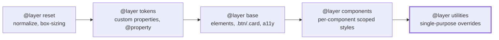
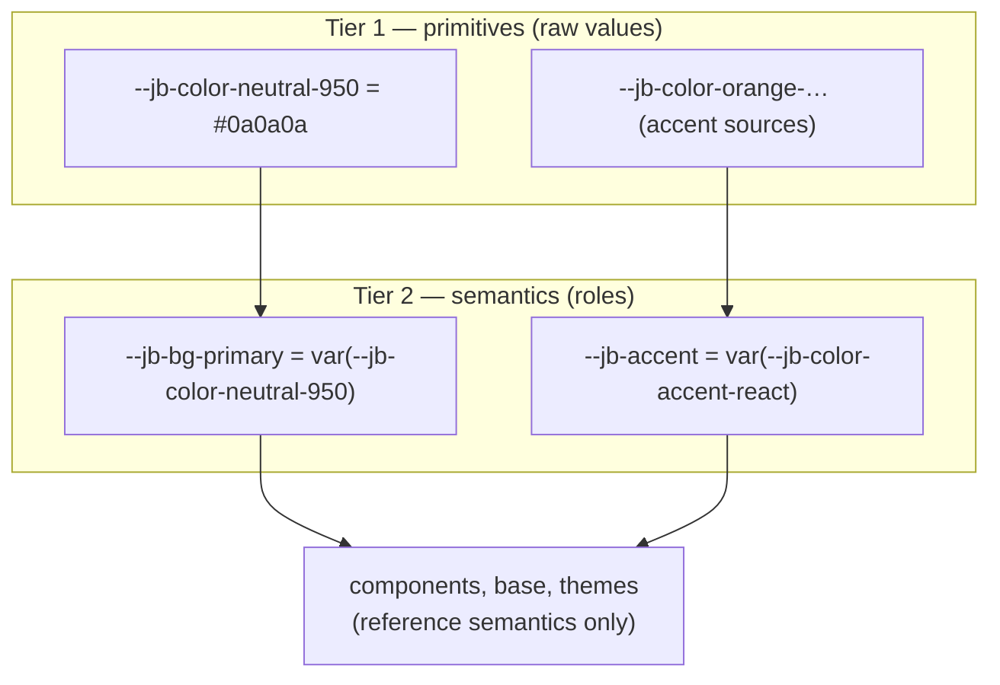
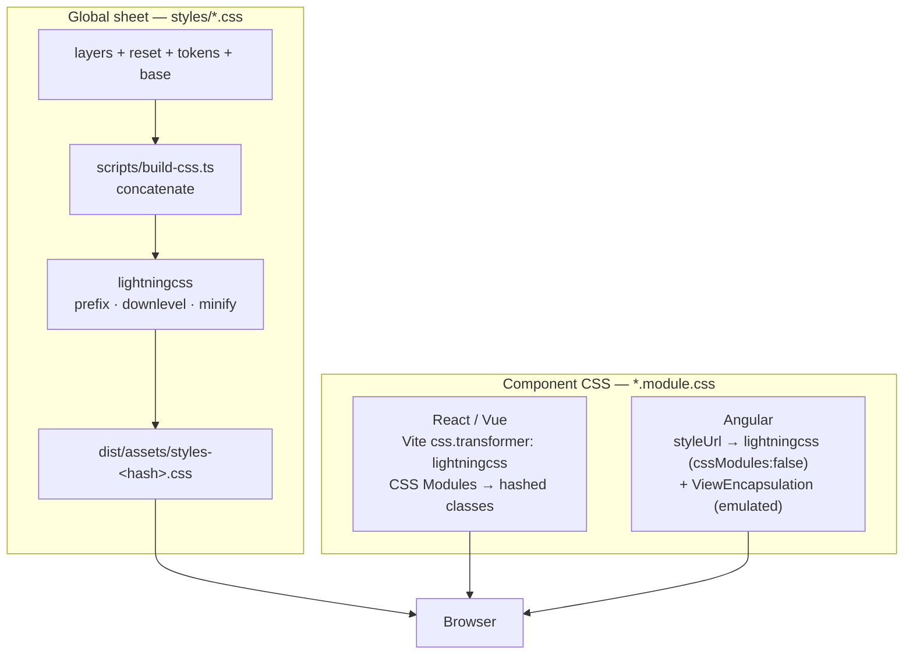
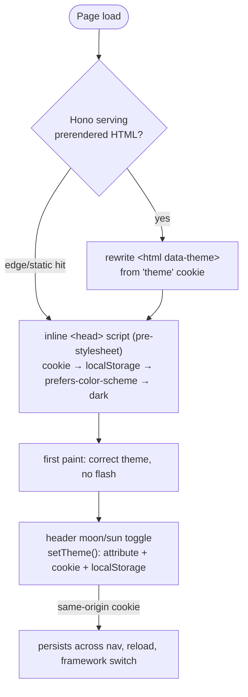
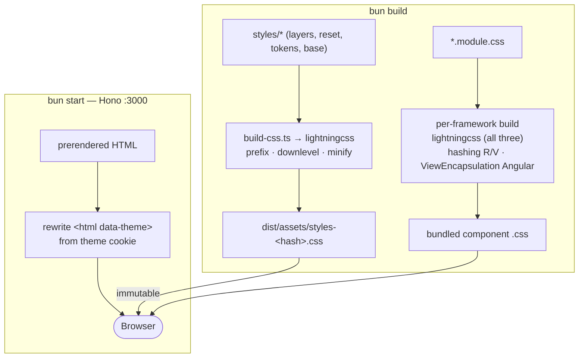

# CSS Architecture

How styling is structured across the three framework variants: an explicit
cascade, a namespaced two-tier token system, two distinct build pipelines, and a
zero-flash theme. The goal is that the same design system renders identically in
React, Vue, and Angular, with conflicts resolving deterministically regardless of
load order.

## Cascade layers

All styles live in named cascade layers, declared once in `styles/layers.css` and
loaded before any other rule. Later layers win; within a layer, normal specificity
and source order apply. This makes conflict resolution independent of which
stylesheet loads first.

- Precedence increases left → right; `utilities` wins, `reset` loses.
- **Unlayered styles beat all layered styles** — so the rule is that *everything*
  global lands in a layer. The one deliberate exception is per-component scoped
  CSS (see below): those selectors are already unique, so leaving them unlayered
  is harmless and they correctly win over generic `@layer base` rules.

## Design tokens — two tiers, one namespace

Tokens use the `--jb-` namespace (JiggyBit) so they can't collide with third-party
custom properties in the shared cascade (custom properties are *not* scoped by CSS
Modules or Angular emulation). They are organized in two tiers: **primitives** hold
raw values; **semantics** name a role and reference a primitive. Components and
themes consume **semantic** tokens only.

- Primitives can be re-tuned freely; only the semantic names are a stable contract.
- Themes (`[data-theme="dark|light"]`) remap the semantic surface/text tokens to
  different primitives. Per-framework accent is the only intended visual
  difference: `[data-framework]` reassigns `--jb-accent` to the matching primitive.

## Two CSS pipelines

The **global stylesheet** and the **per-component styles** are built by two
separate toolchains — a distinction that must be explicit, because it determines
where prefixing/downleveling happens and how class names are scoped.

- The global sheet is hand-concatenated by `build-css.ts`; **lightningcss is its
  only processing step** (prefixing, downleveling to the Baseline floor, and
  minification — see `scripts/css-targets.ts`). High value here.
- Component CSS is small and goes through each framework's own pipeline. React/Vue
  run it through Vite's lightningcss transformer (auto-prefixes e.g.
  `backdrop-filter`). Angular compiles `styleUrl` through its **own** compiler, so
  it does not use Vite's transformer at all.
- These two pipelines also behave differently between dev and production — see
  [Dev vs production](#dev-vs-production).

## Per-framework component scoping

| Variant | Scoping | Class access |
|---|---|---|
| React | CSS Modules (hashed) | `styles.header`, `styles['switcher-btn']` |
| Vue | CSS Modules (hashed) | `:class="styles['switcher-btn']"` |
| Angular | ViewEncapsulation (emulated, `_ngcontent`) | literal `class="switcher-btn"` |

Two decisions here are deliberate and non-obvious:

1. **Angular runs lightningcss with CSS Modules disabled**
   (`css.lightningcss.cssModules: false`). lightningcss prefixes/downlevels
   Angular's component CSS to the shared targets but does **not** hash class names,
   so Angular's emulated ViewEncapsulation stays responsible for scoping (it
   rewrites `.header` → `.header[_ngcontent-…]`). Note `css.modules` is *ignored*
   under lightningcss — `css.lightningcss.cssModules` is the effective switch; an
   initial attempt that left hashing on produced `.gMpzIq_header`, which never
   matched Angular's `class="header"` and broke styling.
2. **Kebab class names + bracket access, no `localsConvention`.** Class names are
   conventional kebab-case (`.switcher-btn`). The React/Vue Vite configs do **not**
   set `localsConvention: 'camelCase'` — under lightningcss that conversion silently
   drops multi-word locals from the JS export map. Multi-word classes are therefore
   read via bracket access (`styles['switcher-btn']`); single-word ones use dot
   access (`styles.header`).

> Component `@layer components` placement is intentionally deferred: hand-wrapping
> the shared module file breaks Angular's emulated encapsulation, so components are
> currently unlayered (correct — scoped styles legitimately win over `@layer base`).

**Invariant — no cross-component descendant selectors.** A descendant selector in a
shared component stylesheet must have its ancestor *and* its descendant rendered by the
**same** Angular component. Angular's emulated encapsulation suffixes every selector
part with that component's `_ngcontent` attribute, so a rule like
`.timeline[data-filtering] .filter-bar` — where `.timeline` is rendered by one component
and `.filter-bar` by another — is rewritten to demand a single `_ngcontent` on both and
silently never matches, while React/Vue CSS Modules (no such attribute) match it fine.
The bug is therefore invisible in two of the three variants. Express any cross-component
relationship as a **flag on the descendant's own element** instead: set `data-active` on
the `.filter-bar` element (from its own component) and style `.filter-bar[data-active]`.
The motion reveal follows the same rule — the entry's parked state lives on
`.entry[data-reveal]` (its own element), not on a `.page …` ancestor selector.

## Responsive design

The site is **mobile-first**: the unprefixed rule is the small-screen baseline, and
wider layouts are layered on with `min-width`-style queries. Mobile is the intended
design, not "desktop minus features", so base rules describe the phone and the
enhancements grow upward. There are no `max-width` layout queries.

- **Range syntax.** Breakpoints use the modern range form — `@media (width >= 1025px)`
  rather than `@media (min-width: 1025px)`. It reads cleanly and pairs without the
  classic off-by-one overlap. (It's inside our Baseline floor: Safari 16.4+.)
- **Most scaling is fluid, so breakpoints stay few.** Typography and spacing scale with
  `clamp()` and the `--jb-space-*` scale (e.g. `.section-title`, the `section` padding),
  which absorbs most of the responsive range. Discrete breakpoints are reserved for
  genuine layout changes, and each is chosen where the content actually breaks — not
  from a device table.

### Breakpoints in use

Values are deliberately per-surface, not a shared `sm/md/lg` scale: no two surfaces
share a threshold, so a named scale would force unrelated layouts onto the same number
and obscure *why* each was chosen. Each lives next to the rule it governs.

| Breakpoint | Surface | What changes |
|---|---|---|
| `width >= 401px` | header (`header.module.css`) | smallest-phone cluster relaxes to standard edge padding, full-size logo, roomier switcher |
| `width >= 769px` | `tokens.css`, `base.css` | nav-height token grows `3rem → 3.5rem`; body drops the bottom tab-bar clearance |
| `width >= 981px` | timeline (`timeline.module.css`) | desktop "assemble" scroll reveal (motion only — layout is separate, below) |
| `width >= 1025px` | header ↔ bottom-nav | **nav swap** — top-bar nav appears, fixed bottom tab bar hides |
| `width >= 1201px` | timeline | stacked single column → multi-lane grid + sticky lane headers |
| `@container 27rem / 76rem` | services & proof grids | 1 → 2 → 4 columns (container width) |
| `@container 36rem` | framework ribbon | stacked label-over-track → 6rem label + track row (container width) |

**Paired invariant — the nav swap is a contract across two files.**
`header.module.css` reveals the top-bar nav at `width >= 1025px`; `bottom-nav.module.css`
hides the fixed bottom tab bar at the *same* `width >= 1025px`. Exactly one primary nav
is shown at any width — editing one breakpoint without the other silently produces two
navs or none. Keep them in lockstep. (The lone `769px` value is unrelated: it only tunes
the bar's reserved height/clearance for true phones, below the swap.)

### Viewport queries vs container queries

The split is by *what the decision depends on*:

- **Viewport (`@media`)** for device-class / page-chrome decisions: the nav swap, the
  body padding and nav-height token, and whether the timeline's dense grid fits the page.
- **Container (`@container`)** for component layout that should react to the space the
  component actually has, not the window. The homepage **services** and **proof** card
  grids and the **framework ribbon** rows use container queries, so their column/row
  layout follows their own width and stays correct if the component is ever placed in a
  narrower slot.

Two implementation notes for the container queries:

1. **The size container is a wrapper, never the grid or the cards.** `container-type`
   applies size/layout containment, which can clip or collapse the cards' relative-
   positioned spotlight/sheen layers. Each grid's surrounding column carries
   `container-type: inline-size` (`.services-body`, `.proof-body`, `.exposure-body`),
   and the grid queries it. The ribbon's container wraps both the ribbon rows *and* the
   shared legend (a sibling of the ribbon blocks), so both align together.
2. **Queries are anonymous (no `container-name`).** Each grid has exactly one container
   ancestor, so an unnamed `@container` resolves unambiguously — and it sidesteps any
   question of whether CSS Modules / Angular encapsulation would scope a container name
   consistently across the two pipelines.

Container query thresholds are **container** widths, re-derived from the grid's own room
rather than copied from the old viewport values (the page container is `min(1320px, 90vw)`,
so it's narrower than the viewport, and its `~82.5rem` ceiling is why the four-up step sits
at `76rem`, not the old `85rem` which the container could never reach).

### Why breakpoint values are literal, not tokens

Custom properties can't be used in `@media`/`@container` conditions, and there's no
shared `@custom-media`: the [two CSS pipelines](#two-css-pipelines) compile separately,
so a custom-media defined in `tokens.css` would never reach the component modules. With a
handful of single-use, content-derived values, a codegen step or duplicated token would
be churn for no payoff — the values stay literal, documented here, and commented at each
rule. Container queries are Baseline Widely Available within our floor (Safari 16.4+), so
they need no `@supports` guard; the single-column / stacked base is itself the correct
fallback anywhere they don't apply.

## Theme resolution & zero-flash

Dark is the default. The initial theme resolves **stored choice → system
preference → dark**, and must be correct before first paint.

- The cookie is server-readable, so the Hono shell/handler can set `data-theme`
  server-side (works with JS disabled). The inline script covers direct/edge hits.
- The toggle's moon/sun icon swap is driven purely by `[data-theme]` in CSS — no JS
  state, so there's no hydration mismatch and the icon is correct before hydration.
- Shared logic lives in `packages/shared/src/theme.ts`; each framework's header
  calls `toggleTheme()`.

## What lightningcss provides

lightningcss runs on the global sheet (in `build-css.ts`) and on **all three**
frameworks' component CSS (as the Vite transformer). It gives us:

- **Automatic vendor prefixing** to the Baseline target (e.g.
  `-webkit-backdrop-filter`), so no prefixes are hand-maintained.
- **Downleveling** of modern syntax to the target floor — CSS nesting flattened,
  `color-mix()` fallbacks where statically computable, etc.
- **Minification** of the production global sheet.
- One fast (Rust) tool in place of a PostCSS + autoprefixer chain.

All three frameworks (and the global sheet) target the **same** browser floor: the
Vite configs and `build-css.ts` import `cssTargets`, which derives from the
repo-root `.browserslistrc` — a single source of truth, also honored by Angular's
browserslist-aware tooling. Prefixing/downleveling stays aligned across frameworks
regardless of how much component CSS exists; there is no per-framework target drift.

Angular is included by setting `css.lightningcss.cssModules: false`, so the
transform runs **without** hashing class names — scoping stays with
ViewEncapsulation (see above). `css.modules` has no effect under lightningcss; the
`css.lightningcss.cssModules` switch is what matters.

Caveat: lightningcss does not support CSS preprocessors. Component CSS here is plain
CSS, so this is a non-issue; introducing `.scss` component styles would require
revisiting the transformer choice.

## Dev vs production

The two modes run materially different pipelines. The most consequential
difference: the global sheet is only processed by lightningcss in the production
build.

### Development (`bun dev:all`)

- Global CSS is concatenated on the fly and served **raw** — no prefixing,
  downleveling, or minification.
- Component CSS is injected as a `<style>` by Vite (no separate `.css` request);
  all three run through lightningcss (Angular with CSS Modules off, so
  ViewEncapsulation does the scoping).
- `data-theme` is set only by the inline `<head>` script — the server-side cookie
  rewrite is a production-only path.

### Production (`bun build` + `bun start`)

- The global sheet is transformed once at build time and served `immutable`.
- Hono serves prerendered HTML and sets `data-theme` server-side from the cookie
  (plus the inline script), so the correct theme paints with no flash even with JS
  disabled.

Net: verify any change sensitive to prefixing or downleveling against a production
build — it will not surface in dev.

## Progressive enhancement

Newest-tier features (cross-document View Transitions, scroll-driven animations,
etc.) are authored behind `@supports` and `prefers-reduced-motion` so unsupported
browsers get a correct baseline. lightningcss targets are pinned to the Baseline
"Widely available" floor; baseline features are downleveled, newest-tier features
stay as enhancements.

<!-- When the framework-switch disintegration lands, credit Mike Bespalov's
     "Thanos snap" technique here and in the effect's source. -->

## Button & Link primitives

Every action and link is built from two primitives defined as global classes in `styles/base.css`
(`@layer base`) and consumed identically by the React, Vue, and Angular wrappers under each
package's `components/ui/`. Keeping the appearance in the global layer (not per-component modules)
is deliberate: an unlayered CSS Module would out-specify a layered `.btn` rule and silently win, so
the modules own layout only and the primitives own appearance.

The **Button** has three orthogonal axes:

- **variant** (paint): `primary` (accent fill), `inverted` (on an accent panel), `secondary`
  (bordered), `ghost` (accent text, no border).
- **size** (geometry + density): `md` is the prominent body-font action; `sm` is the compact,
  monospace, accent-soft action for dense rows (the timeline write-up + source links). The small
  size is a quieter identity by design so a row of them never competes with a real call to action.
- **tone** (casing): the default is **sentence-case**, for in-content actions. `marketing` is the
  loud uppercase + letter-spaced treatment, an **opt-in reserved for headline calls to action** —
  currently the homepage closing CTA and the contact submit, nothing else.

The **Link** is text-first: `inline` (accent link, underline on hover) and `arrow` (a trailing
read-more affordance).

Out of scope of this system: navigation chrome (header nav, framework switcher, bottom tab bar,
icon buttons) and non-interactive tags/badges (covered next). Those label or filter; they do not act.

## Tags & badges

The inert metadata labels — employment-type status, industry/sector, agency, and technology tags —
are a `.tag` family in `styles/base.css` (`@layer base`), **with no component at all**. A tag is a
``; wrapping a coloured span in a component would be ceremony for zero
behaviour. This is the third tier of a deliberate, behaviour-based boundary:

- stateful / form-associated primitives → **web components** (`jb-input`, `jb-theme-toggle`)
- interactive idiom (routing/submit) → **per-framework** components over a global class layer (Button/Link)
- inert metadata → a **pure class layer**, no component (Tag)

Variants: `.tag--status` (colour-coded by `data-kind`, with theme-independent identity fills and
AA-tuned theme-aware text inks `--jb-timeline-ink-*`), `.tag--neutral` (uncoloured taxonomy label),
and `.tag--tech` (technology token). **Shape carries meaning**: a full pill (`99px`) is a taxonomy
label; the small radius is a technology token, sharing the shape of the interactive filter pills.
A `forced-colors` rule re-asserts a system-colour border so the tints survive high-contrast mode.
